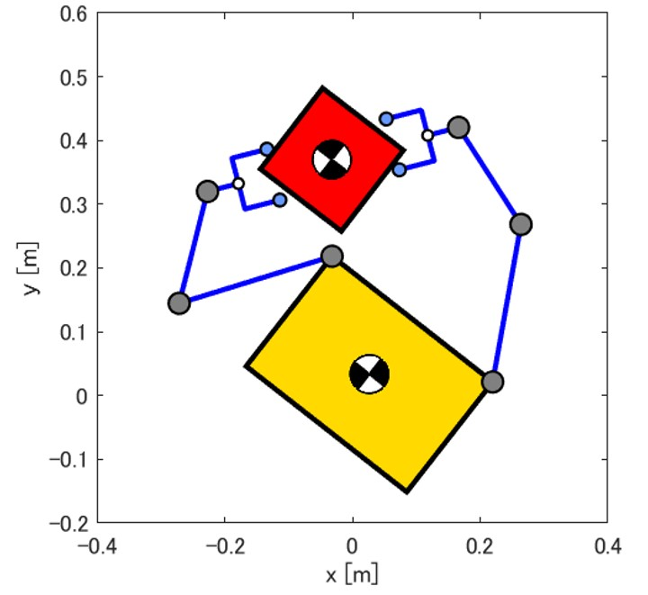
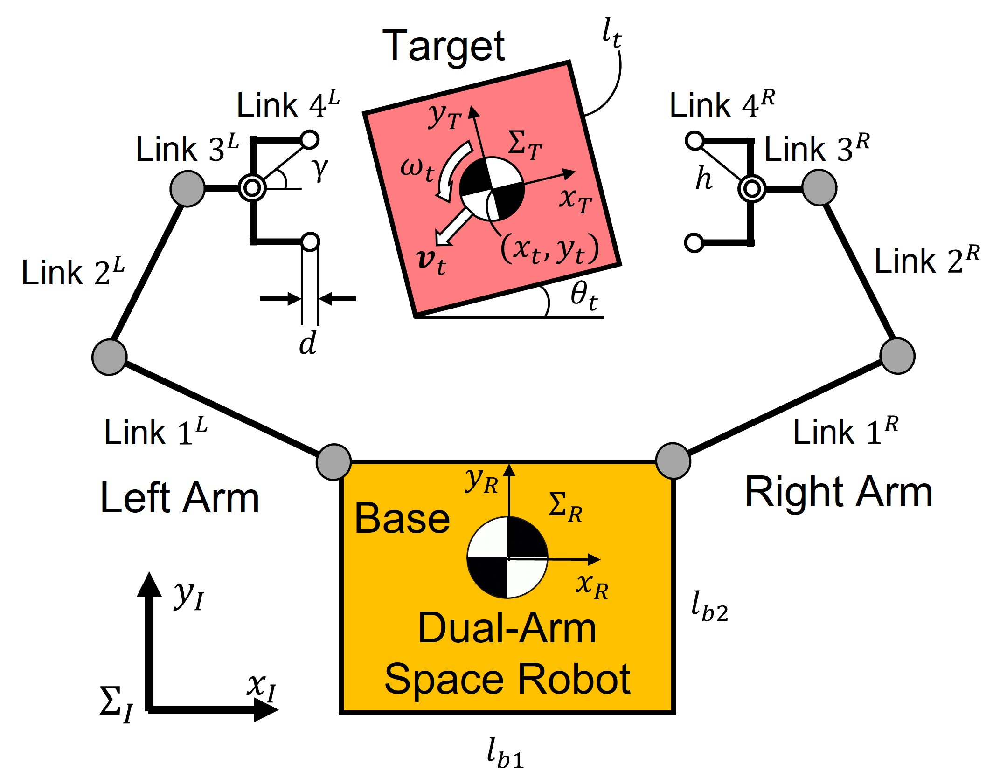
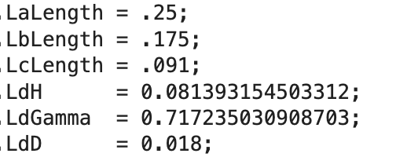

# Space Debri Capturing Robot Simulations
<center></center>

-- Space debris capturing by the dual-arm service robot testbed

Author(s) and maintainer(s): Space Robotics Lab. Orbital Team

* **Repository admin**: Akiyoshi Uchida (uchida.akiyoshi.s3 at dc.tohoku.ac.jp)

* **Team admin**: Kentaro Uno (unoken at tohoku.ac.jp)

## Repository Summary 

This repository contains the necessary codes for two-dimensional and three-dimentional capture simulation written mainly using MATLAB. These codes include inverse kinematics calculations, contact force calculations, and contact determination.
A MATLAB tool called SpaceDyn, developed by the Tohoku University Space Robotics Laboratry is used for this capture simulation.
In addition, you can use blender python script to make more realistic movies of calculated motion. 

## Overview of 2-D Capture Simulation

In our laboratory, a dual-arm space robot test bed has been developed to experimentally verify the capture of a target that resembles space debris in a two-dimensional plane. The simulation was developed to validate the experimental results and to predict the behavior when the conditions are changed. By changing the parameters, the robot model can be changed and the shape of the target to be captured can be changed. Followign are parameters of the blender modeled robot's.

<center>


</center>

## Overview of 3-D Capture Simulation

It is difficult to reproduce a three-dimensional microgravity environment, so three-dimensional simulation is now under developing.

## Software

Dynamics calculation and simple animation code is written in :

* MATLAB code

Realistic animation code is written in :
* Python ( bpy library)


detailed information to run simulations, refer to next section this README.


## Requirements

All code is confirmed to work in

* MATLAB R2020a
* MATLAB R2022b
* MATLAB R2023a

## Operation procedure

Make sure your environment satisfy the requirement above. Then you can run the code as follows.

#### 1. Clone the repository

You can simply clone this monorepository to access to whole software stack. To clone the repository, to avoid messing up, we reccomend you to make the independent directory in your home directory (e.g. named "git-hub") and clone the repository there.
```commandline
$ mkdir ~/git-hub && cd ~/git-hub
$ git clone git@github.com:Space-Robotics-Laboratory/MATLAB_space_debri_capturing_sim.git
```
You can checkout "develop" branch, which contains the latest code if needed (default: "master" branch).
```commandline
$ git checkout origin/develop
```

#### 2. Path Settings
In Matltab UI, go to "Home", "Path Settings", and select "two-dimensional" or "three-dimensional" . Then select "Add subfolders too" and save. After that, you can use functions in the directory. 


__importtant :__ 
__You must not add '[UNUSED]old_references' to the path.__ They are using some functions which have the same name as Matlab native code so simulation does not work.


#### 3. Change the Dat Path
In setParam.m file, you can change the path to the directory where you want to save the output results.
```commandline
param.DataSavePath = '~/github/MATLAB_space_debri_capturing_sim/two-dimensional/dat';
param.FileName     = 'myFile';
```

#### 4. Run the code
Click the "Run" button to run the simulation. For more infirmation on how to use, please see README.md under 'two-dimensional' or 'three-dimensional'.


## Contribution

The development of the capture simulation tool using the dual-arm space robot is currently being conducted in the Space Robotics Lab within the Orbital Robotics Team, and the code improvements and additional implementations are versioned in the Orbital Team's git-hub.

#### Git instructive manual
For the detailed work flow under Git version control, refer to the team  instruction "[How to work in Git version control](https://docs.google.com/document/d/13-IrYbyNjKKX8clBSvSaJXkNx-QB75IRIWgK_Yo4LD4/edit)" (team member access only)

#### Branches

* master

	"master" branch contains the stable code released from time to time through code reviewing. If a bug is found in this branch, it is immediately fixed. **It is prohibited to work directly in this branch.**

* develop

	"develop" branch contains the latest version of the code. Stability is less greater than "master" branch. **It is prohibited to work directly in this branch.**

* feature/xxxxxx

	Branches with the prefix "feature/" is the workspaces to implement new functuions.

#### Contribution
Make your own branch with the prefix "feature" from "develop" branch for your work space.
```
$ git checkout develop
$ git checkout -b feature/yourFeatureBranchName
```
#### Code review

After implementing your work, through the pull request and code review process, your works will be merged into "develop" branch. Pull request can be sent in bitbucket web GUI.


## Reference
[1] T.Matsushita, K.Yoshida, "EXPERIMENTAL VERIFICATION ON CAGING-CAPTURE OF A FREE-FLOATING OBJECT BY A DUAL-ARM SPACE ROBOT", Submitted to i-SAIRAS, 2020.

**You can also find the publications in team's shared drive.**

## Release note

This code is not yet released.

## FAQ
