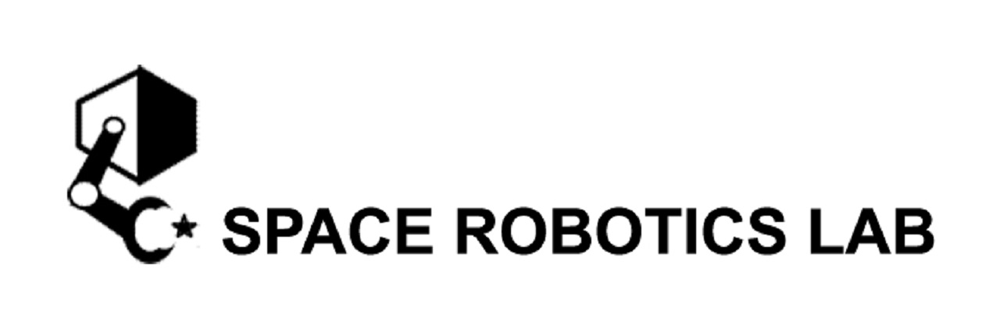

# Space Debri Capturing Robot Simulations

|||
|----|----|
|2D blender|2D Matlab|
|||
|3D blender|3D Matlab|
|||

-- Space debris capturing by the dual-arm service robot testbed

Author(s) and maintainer(s): Space Robotics Lab. Orbital Team



* **Repository admin**: Akiyoshi Uchida (uchida.akiyoshi.s3 at dc.tohoku.ac.jp)

* **Team admin**: Kentaro Uno (unoken at tohoku.ac.jp)

## Repository Summary

This repository contains the necessary codes for two-dimensional and three-dimensional capture simulation written mainly using MATLAB. These codes include inverse kinematics calculations, contact force calculations, and contact determination.
A MATLAB tool called SpaceDyn, developed by the Tohoku University Space Robotics Laboratory is used for this capture simulation. See [SpaceDyn](https://github.com/Space-Robotics-Laboratory/SpaceDyn) for more information.
In addition, you can use blender-python script to make more realistic movies of calculated motion.

## Citation

If you write an academic paper using the codes in this repository, please cite the following article. You can also check our [movie](https://www.youtube.com/watch?v=SRTtrgRimoA&ab_channel=SpaceRoboticsLab) on youtube!

```
@article{uchida2024,
  author={Uchida, Akiyoshi and Uno, Kentaro and Yoshida, Kazuya},
  booktitle={2024 International Conference on Space Robotics (iSpaRo)}, 
  title={Space Debris Reliable Capturing by a Dual-Arm Orbital Robot: Detumbling and Caging}, 
  year={2024},
  pages={194-201},
  keywords={Solid modeling;Attitude control;Space debris;Force;End effectors;Angular velocity;Impedance},
  doi={10.1109/iSpaRo60631.2024.10687710}}
```

## Software

Dynamics calculation and simple animation code is written in :

* MATLAB code

Realistic animation code is written in :

* Python ( bpy library)

detailed information to run simulations, refer to next section this README.

## Requirements

All code is confirmed to work in

* MATLAB R2020a
* MATLAB R2022b
* MATLAB R2023a

## Usage

Make sure your environment satisfy the requirement above. Then you can run the code as follows.

#### 1. Clone the repository

You can simply clone this repository to access to whole software stack. To clone the repository, to avoid messing up, we recommend you to make the independent directory in your home directory (e.g. named "git-hub") and clone the repository there.

```commandline
mkdir ~/git-hub && cd ~/git-hub
git clone git@github.com:Space-Robotics-Laboratory/MATLAB_space_debri_capturing_sim.git
```

#### 2. Path Settings

In Matlab UI, go to "Home", "Path Settings", and select "two-dimensional" or "three-dimensional" . Then select "Add subfolders too" and save. After that, you can use functions in the directory. **DO NOT** add both folders at the same time.

#### 3. Change the Dat Path

In two-dimensional/parameters/generalParam.m or three-dimensional/parameters/generalParam.m, you can change the path to the directory where you want to save the output results.

```commandline
gParam.dataSavePath = '/dat';
gParam.fileName     = 'myFile';
```

#### 4. Run the code

Open [main_sim.m](two-two-dimensional/src/main_sim.m) code under two-dimensional/src or [MainSimulation.m](three_dimensional/MainSimulation.m) in three-dimensional/src and click the "Run" button to run the simulation. Note that 3d simulation is under developing. For more information, please see README.md under 'two-dimensional' or 'three-dimensional'.

#### 5. View in Blender

Though this action is not necessary, it will help you to make realistic movie.

Open dualArm.blender with blender and set target size in python file. Then, rewrite csv file path of which you want to use referring to the comments. After them, run the code on blender to apply the motion.
Do not forget to save the blender file with new name to conserve the original one.

## Backup branch

Branches which have the name `backup` is not used. We just save it for internal usage.

## References

```
@article{matsushitaexperimental,
  title={EXPERIMENTAL VERIFICATION ON CAGING-CAPTURE OF A FREE-FLOATING OBJECT BY A DUAL-ARM SPACE ROBOT},
  author={Matsushita, Tomoya and Yoshida, Kazuya},
  booktitle={Proc. i-SAIRAS},
  year={2020}
}
```

```
@article{haseparametric,
  title={Parametric Analysis on Repeated Impact-Based Capture of a Free-Floating Cylindrical Object by a Dual-Arm Space Robot},
  author={Naoki, Hase and Kenji, Nagaoka and Yoshida, Kazuya},
  booktitle={Proc. i-SAIRAS},
  year={2018}
}
```

## FAQ

Q. _From which frame, LP.cc is defined?_

A. In each link frame. So, position vector like LP.cc(:, n, n-1) and LP.cc(:, n, n) are expressed in link n frame.

Q. _Which is the direction of joint axis?_

A. Z axis direction in link frame. For example, joint n axis is the same as the link n Z axis.

Q. _I multiplied rpy2dc to vector from left, but the result was not what I expected._

A. In SpaceDyn, rpy2dc calculate frame rotation of {b} -> {s}, which is endogenous. This is because roll pitch yaw is defined as endogenous x->y->z. Thanks to this difinition, you can calculate link yaw after joint's rotation as just yaw + phi. As a conclusion, if you want to achieve {s} -> {b} rotation, you can do it by multipling rpy2dc^T to vector from left. For more detail, please see calc_aa.m file.
