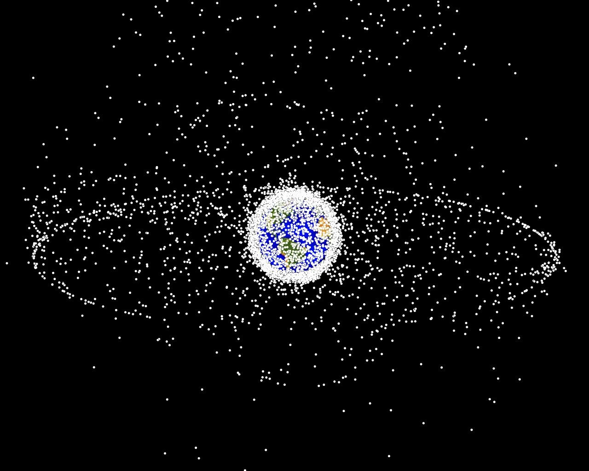

# Space Debri Capturing Robot Simulations
<center></center>

-- Space debris capturing by the dual-arm service robot testbed

Author(s) and maintainer(s): Space Robotics Lab. Orbital Team

* **Repository admin**: Koki Abe (abe.koki.p1 at dc.tohoku.ac.jp)

* **Team admin**: Kentaro Uno (unoken at tohoku.ac.jp)

## Repository Summary 

This repository contains the necessary codes for two-dimensional capture simulation written mainly using MATLAB. These codes include inverse kinematics calculations, target motion estimation, contact force calculations, and contact determination.
In addition, a MATLAB tool called SpaceDyn, developed by the Tohoku University Space Robotics Laboratry is used for this capture simulation.

## Overview of 2-D Capture Simulation

In our laboratory, a dual-arm space robot test bed has been developed to experimentally verify the capture of a target that resembles space debris in a two-dimensional plane. The simulation was developed to validate the experimental results and to predict the behavior when the conditions are changed. By changing the parameters, the robot model can be changed and the shape of the target to be captured can be changed. The current model and parameters are as follows.


#### Model and Parameters
<center></center>


#### Software

All software code is written in :

* MATLAB code

detailed information to run simulations, refer to next section this README.


## Requirements

All code is confirmed to work in

* MATLAB R2020a


## Description of the folders and files

* abeprograms :

 * functions :
contains code for functions used to calculate equations of motion and code for SpaceDyn
In particular, the following two codes are often used because they are related to the setup of the dual-arm space robot model.
 	* DualArm_FourTips_LP_v3.m
 	* DualArm_FourTips_SV_v3.m

 * Shikaku :
 	* main_DualArm_TargetShikaku_FourTips_v07.m :
 	main code for capture simulation
    
 	* target_LP_SV :
 	contains codes used to set the target parameters
    
    * desired_hand_velocity_calculation :
    contains codes to calculate the desired end-effector's velocity of the dual-arm space robot
    
    * contact_physics :
    contains codes for making contact decisions and calculating contact forces
    
    * figure_and_video_creation :
    contains codes to output a figure for each parameter and codes to create a capture simulation movie

Files with InC at the end of the name are codes for impedance control. The calculation of torque control in the main code was changed.

## Parameters that change a lot of times
* ts_W_i :
Angular velocity of the target in inertial coordinate system

* The second line of the vector zeta :
Simulation time

* kw_1 :
Coefficient of rigidity

* cw_1 :
Viscosity coefficient (damping coefficient)

## Operation procedure

Make sure your environment satisfy the requirement above. Then you can run the code as follows.

#### 1. Clone the repository

You can simply clone this monorepository to access to whole software stack. To clone the repository, to avoid messing up, we reccomend you to make the independent directory in your home directory (e.g. named "bitbucket") and clone the repository there.
```commandline
$ mkdir ~/bitbucket && cd ~/bitbucket
$ git clone git@bitbucket.org:srl-orbital/capturing_simulation.git
```
You can checkout "develop" branch, which contains the latest code if needed (default: "master" branch).
```commandline
$ git checkout origin/develop
```

#### 2. Path Settings
Go to "Home", "Path Settings", and select "abeprograms". Then select "Add subfolders too" and save.

#### 3. Change the Path
Change the path to the directory where you want to save the output results.
```commandline
datepath = [ 'C:/Users/baske/OneDrive/デスクトップ/' datestr( now, 'yyyy-mmdd' ) '/' timepath, '_' ];
```

#### 4. Run the code
Click the "Run" button to run the simulation. If you don't need the figure output, prefix the following code with %{ and comment out the rest of the code.
```commandline
% まとめる
mat = [ mat_02(:,1), ...
        mat_02(:,2:1+9-1), rad2deg( mat_02(:,10:end) ), ...
        mat_03(:,2:end), ...
        mat_04(:,2:2+16-1), rad2deg( mat_04(:,18:18+8-1) ), ...mat_04(:,25:27), rad2deg( mat_04(:,28:30) ), mat_04(:,31:33), rad2deg( mat_04(:,34:36) ), ... % vel_desはとりあえず図にしない
        mat_05(:,2:2+9-1), rad2deg( mat_05(:,11:end) ), ...
        mat_06(:,2:end), ...
        mat_07(:,2:end), ...
        mat_08(:,2:end), ...
        mat_09(:,2:end), ...
        rad2deg( mat_10(:,2) ), mat_10(:,3:end), ...
        mat_11(:,2:2+12-1), rad2deg( mat_11(:,14:14+7-1) ), mat_11(:,21:21+6-1), ...
        mat_12(:,2:end), ...
        mat_13(:,2:end)  ];
        													・
        													・
        													・
        													・
```

## Contribution

The development of the capture simulation tool using the dual-arm space robot is currently being conducted in the Space Robotics Lab within the Orbital Robotics Team, and the code improvements and additional implementations are versioned in the Orbital Team's bitbucket.

#### Git instructive manual
For the detailed work flow under Git version control, refer to the team  instruction "[How to work in Git version control](https://docs.google.com/document/d/13-IrYbyNjKKX8clBSvSaJXkNx-QB75IRIWgK_Yo4LD4/edit)" (team member access only)

#### Branches

* master

	"master" branch contains the stable code released from time to time through code reviewing. If a bug is found in this branch, it is immediately fixed. **It is prohibited to work directly in this branch.**

* develop

	"develop" branch contains the latest version of the code. Stability is less greater than "master" branch. **It is prohibited to work directly in this branch.**

* feature/xxxxxx

	Branches with the prefix "feature/" is the workspaces to implement new functuions.

#### Contribution
Make your own branch with the prefix "feature" from "develop" branch for your work space.
```
$ git checkout develop
$ git checkout -b feature/yourFeatureBranchName
```
#### Code review

After implementing your work, through the pull request and code review process, your works will be merged into "develop" branch. Pull request can be sent in bitbucket web GUI.


## Reference
[1] T.Matsushita, K.Yoshida, "EXPERIMENTAL VERIFICATION ON CAGING-CAPTURE OF A FREE-FLOATING OBJECT BY A DUAL-ARM SPACE ROBOT", Submitted to i-SAIRAS, 2020.

**You can also find the publications in team's shared drive.**

## Release note

This code is not yet released.

## FAQ