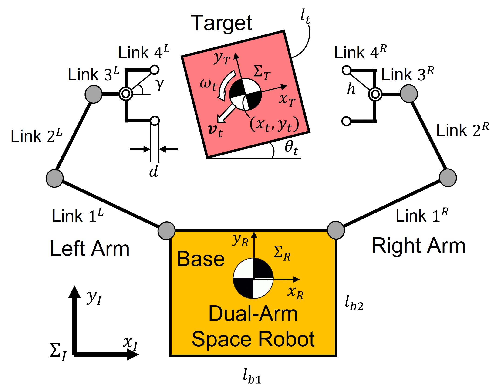

# Space Debris Captureing Robot simulations
## Overview of 2-D Capture Simulation

In our laboratory, a dual-arm space robot test bed has been developed to experimentally verify the capture of a target that resembles space debris in a two-dimensional plane. The simulation was developed to validate the experimental results and to predict the behavior when the conditions are changed. By changing the parameters, the robot model can be changed and the shape of the target to be captured can be changed. 

<center>

</center>

## Initial Robot Shape
Here you can fine the original robot model parameters, same as the ones of blender STL model.

<center>

|Link|Length[m] or Angle[rad] |
|----|----|
|Link 1| 0.25|
|Link 2| 0.175|
|Link 3| 0.091|
|Link 4 h| 0.081393154503312|
|Link 4 γ| 0.717235030908703|
|Link 4 d|0.018|

</center>


## Description of the imprtant folders and files
```
|--two-dimensional
    |--[UNUSED]olr_references
    |--blender/DualArm Robot
        |--origin       : conserved original blender file
        |--dualArm.py   : python script run in blender
        |--dualArmRobo_moved.blend  : blender file of dyn result
        |--dualArmRobo.blend        : blender file of initial robot state
    |--dat
    |--docs
    |--lib
    |--parameters   : parameter setting
    |--src
        |--analysis : analysis using graph
        |--contact  : cont detection and calc force
        |--control  
            |--Pathway/Pathway.m    : A class to handle robo arm distination
            |--Contoroller.m        : A class to calc input motor torque
        |--datsave  
        |--estimation
        |--robot    : robot difinition and calc dyn
        |--target   : target difinition and calc dyn
        |--visualization
```


# Simulation Structure
In "main_sim" under "src", the function of the code can be devided into 4 big parts. 
- Saved Data Update Part
- Contact Caliculation and Estimation Part
- Control Part
- Dynamics Caliculation Part

## Contorol Part
In this simulation, the robot is contolled by input motor torque, thus it's requred to caliculate the desired torque in order to control robot as you want. 

### Controller Class
Inside the "control/Contoroller.m" file, the contoroller class is defined, and you can calculate input torque here as 'obj.tau'. 

You can use a function named 'calc_tau_from_ee_vel' to calculate torque by desired velocity with gerenaralized Jacobian.

You can use Pathway class to set the desired robot hands positions. 

### Pathway Class
Pathway class can handle robot hands target position with goal time. Pathway method, which is under Pathway class, contain DOF 3 desired position ( x, y, theta) and the time to end translation. You can add next goal to the pathway, so robot is able to move its hands in succession.

This class also has a function to calculate desired velocity by pathway, using defined velocity model. 

# Parameters Often Changed
## General Parameters
```
gPram.dataSavePath = '~/github/MATLAB_space_debri_capturing_sim/two-dimensional/dat';
gPram.dataSaveName = 'myFile';
gPram.minusTime = -0.5;
gPram.endTime   = 5;
```
* dataSavePath : You can change the path to save simulation result. It is recommended to set it as above.
* dataSaveName : You can select data save name. In this code, results are saved like below.
* minusTime : It should be defined as minus value. Simulation will start from minus time, and if time is minus, robot joints are not active.
* endTime : Simulation end time. Deeply affects to the calculation time.
```
|-- two-dimensional
    |-- dat
        |-- yyyy-mm-dd
            |-- yyyy-mm-dd-hh-mm-ss
                |-- myFile-dat : data save directory
                |-- myFile-fig : figure save directory
                |-- myFile-mov : movie save directory
                |-- myFile-png : image save directory
```

## Target Parameters
```
targetParam.depth = 0.16;
targetParam.width = targetParam.depth;
targetParam.initial_angular_velocity = [0, 0, 1]';
```
* depth : Target side length. 
* width : Target side length. In this case, assuming square, it is same as depth.
* init_angular_velocity : Initial target angular velocity. As this is 2D simulation, change only z value.

## Contact Parameters
```
cParam.damp  = 20;
cParam.elast = 1000;
cParam.friction = 0.1;
```
* damp : Damping coefficient in contact model. The higher, the softer contact comes.
* elast : Modulus of elasticity in contact model. The higher, the harder contact comes.

## Control Parameters
```
controlParam.controlMode = 'MULTIPLE'; 
controlParam.velocityMode = 'str_tru';           
```
* controlMode : Now, 'DIRECT' and 'MULTIPLE' are available. 'DIRECT' is two hands direct caging, and 'MULTIPLE' is repeated one hand impedance contact, followed by two hands direct caging.

* velocityMode : Currently, 'str_str', 'str_tru' are available. ('str_fbk' is available too, but not useful) the former represents trajectory, the latter does speed model. For example, str_str model is straight trajectory with constant velocity, str_tru means straight trajectry with triangle speed-time graph. (constant acceleration)

